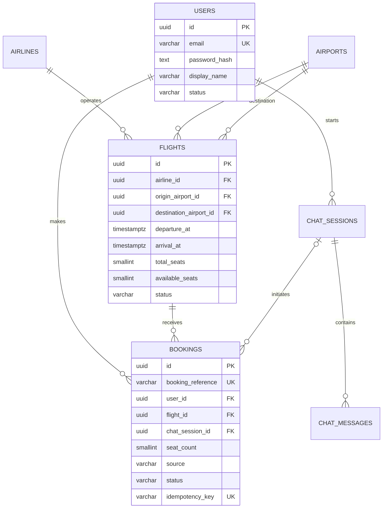
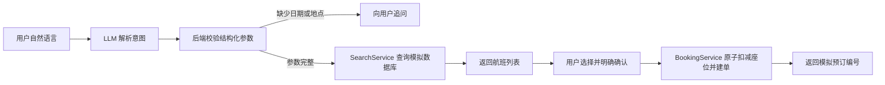

# 模拟机票预订系统：数据库与 AI 可行性设计

## 1. 范围结论

本项目是教学用途的模拟订票系统，不接入真实航班供应商，也不处理真实乘客、证件、票价或支付数据。

数据库只需覆盖七个核心实体：

1. `users`：注册、登录和 JWT 身份来源。
2. `airlines`：模拟航空公司。
3. `airports`：机场与城市查询数据。
4. `flights`：模拟航班、时间和固定座位数。
5. `bookings`：用户对航班的模拟预订。
6. `chat_sessions`：AI 对话会话。
7. `chat_messages`：对话、工具参数和精简工具结果。

完整建表 SQL 位于 `database/schema.sql`。

## 2. ER 关系



## 3. 关键数据库决定

### 航班和座位

每一行 `flights` 代表某一天、某一时间实际起飞的一班模拟航班，而不是抽象的每日航班模板。每班航班直接保存：

- `total_seats`：固定总座位数。
- `available_seats`：当前剩余座位数。
- `status`：`SCHEDULED`、`DELAYED`、`CANCELLED`、`DEPARTED` 或 `ARRIVED`。

项目不划分经济舱、商务舱等舱位，也不分配具体座位号。

### 预订

`bookings` 不包含乘客和付款信息，只保存：

- 哪个用户预订了哪班航班；
- 一次预订占用多少座位；
- 预订来自普通 UI 还是 AI；
- 当前是已确认还是已取消；
- 唯一 `idempotency_key`，防止双击或 AI 重试造成重复预订。

### 并发扣减座位

不能先读取 `available_seats` 再在另一条语句里随意更新，否则两个请求可能同时订到最后一个座位。后端应在一个事务内执行原子更新：

```sql
BEGIN;

UPDATE flights
SET available_seats = available_seats - :seat_count
WHERE id = :flight_id
  AND status = 'SCHEDULED'
  AND available_seats >= :seat_count
RETURNING id;

-- 如果没有返回行，后端返回 SOLD_OUT，不插入 booking。
-- 如果有返回行，再插入带唯一 idempotency_key 的 booking。

COMMIT;
```

取消预订也应放在事务内：只有 `CONFIRMED -> CANCELLED` 成功一次时，才把 `seat_count` 加回航班，避免重复取消造成座位数超过上限。

### 时间

数据库统一使用 `timestamptz` 存储起飞和到达时间。Android UI 根据机场或用户时区显示，避免北京、香港或其他城市的本地时间被误解。

## 4. AI 功能的正确边界

AI 不应直接生成 SQL，也不应拥有数据库账号。它只负责理解用户文字并请求少量白名单工具，真正的查询、权限验证和写入全部由后端完成。

建议的工具只有：

- `search_flights`：按出发地、目的地、日期、时间范围和航空公司搜索。
- `get_flight_details`：读取一个模拟航班的完整信息和剩余座位。
- `create_booking`：在用户明确确认后预订；后端重新检查座位并执行事务。
- `list_my_bookings`：只读取当前登录用户的预订。
- `cancel_booking`：可作为后续功能，同样需要明确确认。

DeepSeek 等 LLM 已提供 Function Calling，可让模型按照定义好的 JSON 参数请求工具；但官方文档也明确说明，具体函数仍需由应用本身执行：[DeepSeek Function Calling](https://api-docs.deepseek.com/guides/function_calling/)。

### 推荐对话流程



普通搜索 UI 和 AI 必须调用同一个 `SearchService`；普通预订按钮和 AI 必须调用同一个 `BookingService`。这样 AI 只是另一种输入界面，不会产生两套业务规则。

### `search_flights` 参数示例

```json
{
  "origin": "Beijing",
  "destination": "Hong Kong",
  "departure_date": "2026-12-08",
  "departure_time_from": "06:00",
  "departure_time_to": "12:00",
  "airline_code": null,
  "seat_count": 1
}
```

后端必须完成以下校验：

- 城市或机场能否映射到本地 `airports` 数据；
- 日期是否明确，尤其是“下周五”这类相对日期；
- 座位数是否为 1–9；
- 航班是否仍为 `SCHEDULED`；
- 当前用户是否已登录；
- AI 发起预订前是否收到明确确认。

## 5. 可行性判断

### AI 搜索：高可行性

自然语言最终只需转换为少量筛选字段，任务边界清楚，使用 Function Calling 和 JSON Schema 即可。数据库完全是本地模拟数据，因此不存在外部航班 API 的授权、限流、价格变化或网络依赖。

### AI 预订：高可行性，但必须加确认步骤

预订只是调用与普通 UI 相同的后端服务。主要风险不是模型能力，而是重复执行、用户表达含糊和并发扣减座位。`idempotency_key`、明确确认和数据库事务可以解决这些问题。

### 不建议的实现

- 让 LLM 输出或执行任意 SQL。
- 把数据库连接信息放在 Android 客户端。
- 仅根据模型说“预订成功”而没有后端 booking 记录。
- 在聊天记录里保存密码、JWT 或其他敏感信息。
- AI 根据不完整日期或未确认的航班直接预订。

## 6. 最小可行版本（MVP）验收标准

1. 能注册、登录并取得 JWT。
2. 数据库有稳定的模拟航空公司、机场和航班 seed data。
3. 普通 UI 能按出发地、目的地、日期、航空公司和起飞时间筛选。
4. 普通 UI 能预订并扣减固定座位数，售罄时返回明确错误。
5. AI 能把至少 20 组测试语句稳定转换为正确搜索参数。
6. AI 搜索与普通搜索返回同一批数据。
7. AI 只有在用户确认后才创建 booking，并返回数据库中的模拟预订编号。
8. 重复发送同一 `idempotency_key` 不会产生第二张 booking。
9. 取消 booking 后只恢复一次座位数。

## 7. 推荐开发顺序

1. 建立 PostgreSQL schema 和 seed data。
2. 实现 Authentication、SearchService 和 BookingService，并先用 Postman 测试。
3. 接入 Android 普通搜索和预订页面。
4. 为现有 SearchService/BookingService 增加 AI 工具包装层。
5. 加入聊天 UI、确认流程、错误处理和固定测试语句集。

这个顺序能保证即使 LLM 暂时不可用，普通模拟订票功能仍然可以完整演示。
